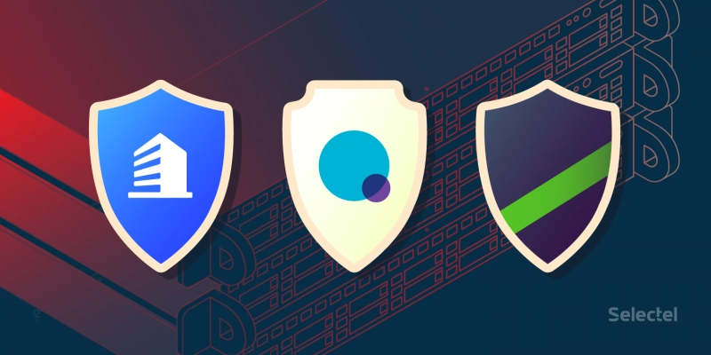
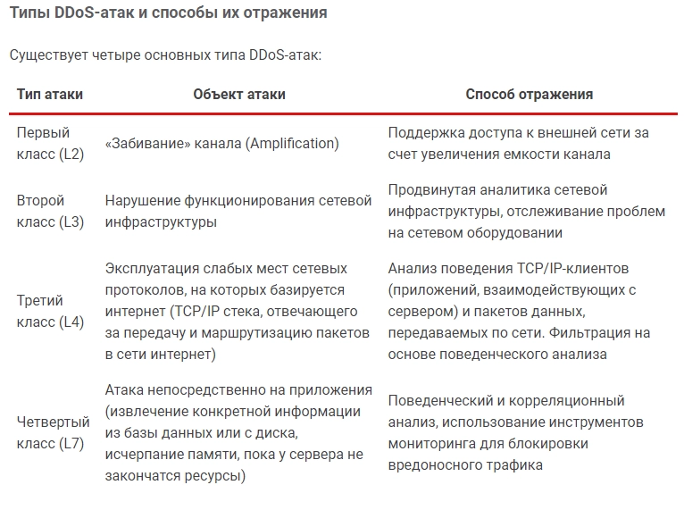
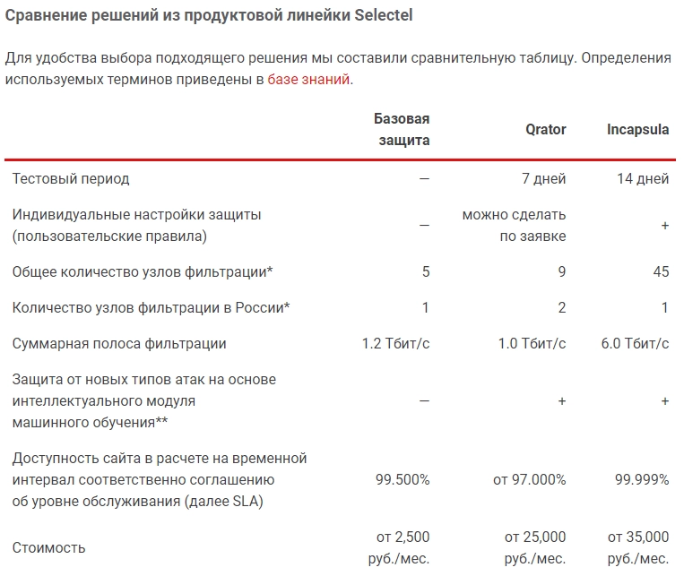

# DDoS Protection: From Basic to Comprehensive Defense

---

Protecting your online business from DDoS attacks isn't optional anymore—it's essential. Whether you're running a small blog or managing enterprise infrastructure, choosing the right protection level can mean the difference between smooth operations and costly downtime. This guide breaks down practical DDoS protection strategies that scale with your business, from basic network-level defense to comprehensive application security.

---

## Why DDoS Protection Matters Now More Than Ever

Your website's uptime directly impacts your bottom line. A successful DDoS attack doesn't just knock your site offline—it damages customer trust, kills conversions, and hands opportunities to competitors.

The threat landscape has evolved dramatically. According to Kaspersky Lab research, DDoS attacks increased fivefold between September 2017 and September 2018. Even more concerning, launching an attack has never been cheaper. Services now offer DDoS-as-a-Service with pay-per-second pricing—a devastating 125 Gbps attack for just 5 minutes costs a mere 5 euros. When attacking your business costs less than a coffee, prevention becomes critical.

DDoS attacks come from various sources: jealous competitors trying to steal market share, criminal organizations demanding ransom, or even bored hackers looking for entertainment. Regardless of the attacker's motivation, the result is the same—your site goes down, revenue stops, and reputation suffers.

## Understanding DDoS Attack Types

DDoS attacks typically target different layers of your infrastructure:

**Network Layer Attacks (L2/L3)**: These flood your internet connection with massive traffic volumes, overwhelming bandwidth capacity. Think of it as thousands of cars suddenly blocking your business entrance—legitimate customers can't get through.

**Application Layer Attacks (L7)**: More sophisticated attacks target your web applications directly, mimicking legitimate user behavior to exhaust server resources. These are harder to detect because they look like real traffic.

**Multi-vector Attacks**: The most dangerous type combines multiple attack methods, shifting between network and application layers to bypass standard defenses.

## Choosing the Right Protection Level

Most businesses lack the technical expertise and specialized equipment for in-house DDoS mitigation. Partnering with professional security vendors makes sense—but which solution fits your needs?

The key principle: protection costs should align with potential losses. Don't overspend on enterprise-grade defense if you're running a small blog, but don't cheap out if downtime costs thousands per hour.

### Basic DDoS Protection

Perfect for startups, small businesses, and blogs just getting established. Basic protection shields against common network layer attacks (L2/L3) that flood your internet connection. When you add application-level protection, you also get defense against simple L7 attacks.

**What you get**: Automatic filtering of malicious traffic before it reaches your servers. The system identifies attack patterns and blocks them while allowing legitimate visitors through.

**Important consideration**: If your site uses HTTPS encryption, you'll need to provide your SSL certificate to the protection provider. They can't filter encrypted traffic without it—trying to protect HTTPS traffic without the certificate is like asking a security guard to inspect locked boxes.

**Best for**: Personal websites, small e-commerce stores, startup landing pages, blogs with moderate traffic.

### Universal Protection Solutions

Medium-sized businesses operating under regular attack pressure need stronger defense. Universal protection handles most DDoS attack types automatically, defending against both network floods and application-targeted assaults.

The system adapts on the fly. When attacks shift from network layer to application layer, protection adjusts automatically without manual intervention. You're covered against sudden traffic spikes, bot armies, and coordinated multi-source attacks.

**What you get**: Continuous monitoring, automatic threat detection, and real-time mitigation across multiple attack vectors. The system learns your normal traffic patterns and instantly recognizes anomalies.

**Limitations**: While highly effective, this tier may struggle with extremely sophisticated multi-vector attacks that rapidly shift tactics, or prolonged campaigns consisting of numerous small attacks in continuous succession.

**Best for**: Growing e-commerce platforms, SaaS applications, corporate websites with substantial traffic, online services with regular user activity.

### Comprehensive Enterprise Protection

Large enterprises, high-traffic platforms, and businesses facing persistent targeted attacks require maximum security. 👉 [Discover how comprehensive DDoS protection keeps high-stakes businesses online 24/7](https://cp.gthost.com/en/join/72c7e6b2fc118929f9ede2978f008806)

Comprehensive solutions defend against all attack types, including sophisticated multi-vector campaigns and sustained assault sequences. Beyond basic DDoS protection, these platforms include advanced security features:

**Web Application Firewall (WAF)**: Acts as an intelligent barrier between users and your applications, filtering malicious HTTP/HTTPS requests while allowing legitimate traffic. The WAF understands application logic and blocks exploitation attempts targeting vulnerabilities.

**Administrative Access Protection**: Even if hackers steal or intercept administrator credentials, additional security layers prevent unauthorized access to your control panels and corporate portals.

**Global CDN Integration**: Built-in content delivery network distributes your content across worldwide data centers, improving both performance and attack resilience. When attacks target one region, traffic automatically routes through unaffected locations.

**Advanced Load Balancing**: Sophisticated traffic distribution methods reduce server strain within single data centers or across multiple facilities, maintaining performance during both normal operations and attack scenarios.

**Anti-spam and Bot Protection**: Filters comment spam, prevents account takeover attempts, and blocks malicious bots while allowing search engine crawlers and legitimate automated access.

**Best for**: Major e-commerce platforms, financial services, gaming companies, media streaming services, any business where minutes of downtime cost thousands.

## Making Your Choice

Start by assessing your actual risk. Ask yourself:

- What's your hourly revenue during peak times?
- How would an hour of downtime affect customer trust?
- Have you experienced attacks before?
- Are you in a competitive industry where sabotage happens?
- Do you handle sensitive data that attracts sophisticated attackers?

Calculate the total cost of downtime—lost sales, support overhead, damaged reputation, potential regulatory penalties. Compare that against protection costs. The right solution pays for itself by preventing just one successful attack.

Remember that protection needs evolve. Start with basic coverage if you're small, but plan to upgrade as you grow. Many businesses begin with basic protection and scale up after experiencing their first serious attack—don't wait that long if you can afford stronger defense now.

Technical considerations matter too. HTTPS sites need extra setup for encrypted traffic filtering. International audiences benefit from global CDN integration. Sites with user-generated content need anti-spam capabilities. Match features to your actual infrastructure and usage patterns.

---

## Conclusion

DDoS protection isn't about paranoia—it's about business continuity. The question isn't whether attacks will happen, but when and how prepared you'll be.

Basic protection handles common threats for smaller operations. Universal solutions defend growing businesses under regular attack pressure. Comprehensive platforms secure enterprises and high-value targets against sophisticated campaigns. Each tier serves specific needs and budgets, making protection accessible to businesses of all sizes.

The investment in proper DDoS defense pays dividends through maintained uptime, protected revenue streams, and preserved customer trust. In a landscape where launching attacks costs mere euros while business downtime costs thousands, robust protection becomes not just wise—it's essential for survival. Whether you're just starting out or managing critical infrastructure, the right protection level exists for your situation, and platforms like Gthost provide scalable solutions that grow with your business needs.
